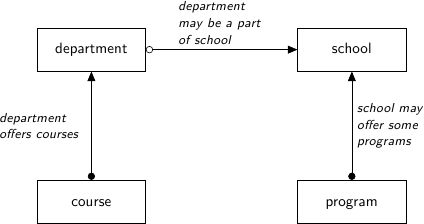

Querying
========

For this we're going to be using the same examples as can be found `here <http://htsql.org/doc/overview.html>`_. That is we have a database for a university, with four tables:

* Schools - a university may have several schools, for example the school of science, the school of arts, and the school of business. The school table has the fopllowing columns:

    * A code (primary key)
    * A name
    * A campus - north campus, south campus, etc. 

* Programs - each school may offer several programs, or degrees - a bachelor of commerse, a bachelor of arts, or a master of arts. The program title has the following columns:

    * A code (primary key)
    * A school code (foreign key)
    * A title (e.g. bachelor of commerce)
    * A degree type - bachelor's, masters, phd, etc. 

* Departments - for example, the physics department might be a part of the school of science. Each department has:
    
    * A code (primary key)
    * A name
    * A school code (foreign key)

* Courses - Departments offer courses, this is pretty self explanatory. each course has

    * A course code (primary key)
    * A department code (foreign key)
    * A number of credits
    * A description

This is summarized in the following diagram:

The Query Object
----------------

Tables are set up in the "Examples" folder. 

Use the `Query.sql` method to display the SQL of a query. 

Selecting
---------

.. code-block:: mysql

    SELECT * FROM user

Filtering
---------

Use the .filter

Joining
-------

Use the `join` method. Most of this is already done by the foreign keys. 

Left Joins
----------

left joining dependents

Aggregation
===========

min by primary key

